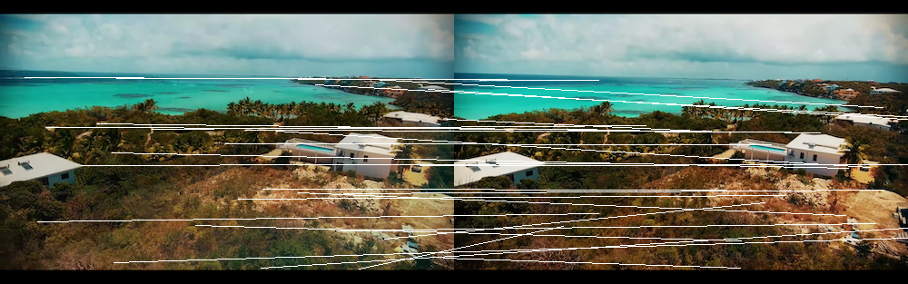
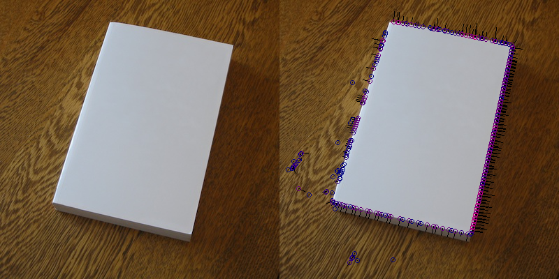

# ORB (Oriented FAST and Rotated BRIEF) Keypoints with Rust

This is mostly a WIP. Implementing Oriented Fast & Rotated BRIEF descriptors with Rust and the image library.

**ORB** Keypoints


```rust
use image;
use orbrs;

fn test() {
    let mut img1 = image::open("examples/money1.jpg").unwrap();
    let mut img2 = image::open("examples/money2.jpg").unwrap();

    let n_keypoints = 50;

    let img1_keypoints = orbrs::orb::orb(&mut img1, n_keypoints).unwrap();
    let img2_keypoints = orbrs::orb::orb(&mut img2, n_keypoints).unwrap();

    let pair_indices = orbrs::common::match_indices(&img1_keypoints, &img2_keypoints);

    let img = orbrs::orb::draw_orb(&img1, &img2, &img1_keypoints, &img2_keypoints, &pair_indices);
    img.save_with_format("examples/money_output.png", image::ImageFormat::Png)
        .unwrap();
}
```

**FAST** Keypoints


Example extracting ORB Features and drawing keypoints:

```rust
use image;
use orbrs;

fn test() {
    let mut img = image::open("example/test.jpg").unwrap();

    let fast_keypoints = orbrs::fast::fast(&img, Some(fast::FastType::TYPE_9_16), None).unwrap();

    // draw the keypoints on the image
    
    orbrs::fast::draw_moments(&mut img.to_rgb(), &fast_keypoints);
    img.save_with_format("example/fast_output.png", image::ImageFormat::Png);
}
```
