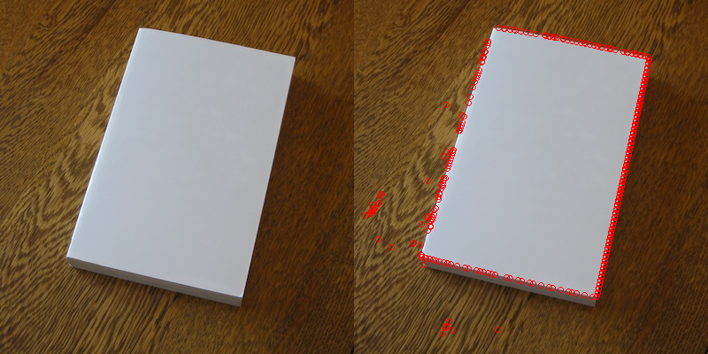

# ORB (Oriented FAST and Rotated BRIEF) Keypoints with Rust

**FAST** Keypoints


Example running FAST and drawing keypoints:
```rust
use image;
use orbrs;

fn test() {
    let mut img = image::open("example/test.jpg").unwrap().to_rgb();
    let mut gray_img = img.to_luma();

    let fast_keypoints = orbrs::fast::fast(&gray_img, Some(fast::FastType::TYPE_9_16), None).unwrap();
    orbrs::fast::calculate_fast_centroids(&gray_img, &mut fast_keypoints);

    // draw the keypoints on the image
    
    orbrs::fast::draw_moments(&mut img, &fast_keypoints);
    img.save_with_format("example/fast_output.png", image::ImageFormat::Png);
}
```

Playing around with Rust. If you stumble across this, keep moving!

TODO:
- Switch to cargo lib (currently bin)
- Optimize FAST
- ORB